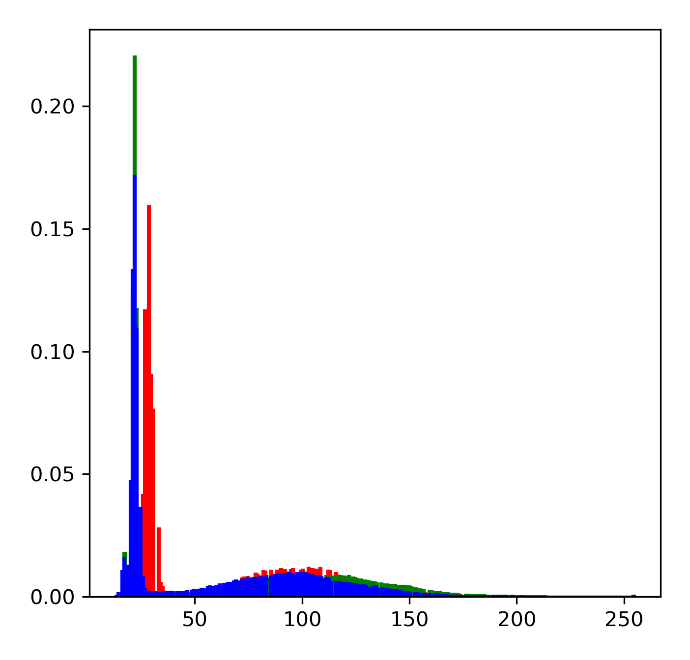

# DIP
 ## Digital Image Processing

> Algorithm: Piecewise Linear Stretch Transformation


-------


### Before processing


<table>
	<tr align="center">
		<td></td>
		<td></td>
		<td></td>
	</tr>
	<tr>
		<td>Picture before processing</td>
		<td>Contrast before processing</td>
		<td>Grayscale before processing</td>
	</tr>
</table>

---------


### After processing

<table>
	<tr align="center">
		<td></td>
		<td></td>
		<td></td>
	</tr>
	<tr>
		<td>Picture after processing</td>
		<td>Contrast after processing</td>
		<td>Grayscale after processing</td>
	</tr>
</table>

---------


### Requirements

- OpenCV(Python)

- Matplotlib
- Numpy

```bash
pip install --upgrade pip
pip install matplotlib -i https://pypi.tuna.tsinghua.edu.cn/simple
pip install numpy -i https://pypi.tuna.tsinghua.edu.cn/simple
pip install opencv-python -i https://pypi.tuna.tsinghua.edu.cn/simple
```

---------


### Optional parameters

- X1
- X2
- Y1
- Y2

---------

### Use Demo

```python
from dip.DIP import DIP
from dip import log as l

if __name__ == '__main__':
    print("==" * 10, "DEMO", "==" * 10)
    log = l.Log(name='log.txt', log_level=l.logging.DEBUG)

    dip = DIP(img_path="./pic/2.png", output_dir="data")
    log.debug(f"Is the image exist? [{dip.is_exist()}]")

    init_img, init_line, init_hist = dip.get_init_img()
    log.info(f"The initial image is in: {init_img}")
    log.info(f"The initial line is in: {init_line}")
    log.info(f"The initial hist is in: {init_hist}")

    dips_img, dips_line, dips_hist = dip.get_dips_img(x1=120, x2=240, y1=250, y2=250)
    log.info(f"The diped image is in: {dips_img}")
    log.info(f"The diped line is in: {dips_line}")
    log.info(f"The diped hist is in: {dips_hist}")
    # draw
    dip.get_cmp_plot(init_img, init_line, init_hist,
                     dips_img, dips_line, dips_hist,
                     i_im="Initial Image", i_li="Intial Contrast", i_hi="Initial Gray Scale",
                     d_im="Diped Image", d_li="Diped Contrast", d_hi="Diped Gray Scale")
    del dip
```

