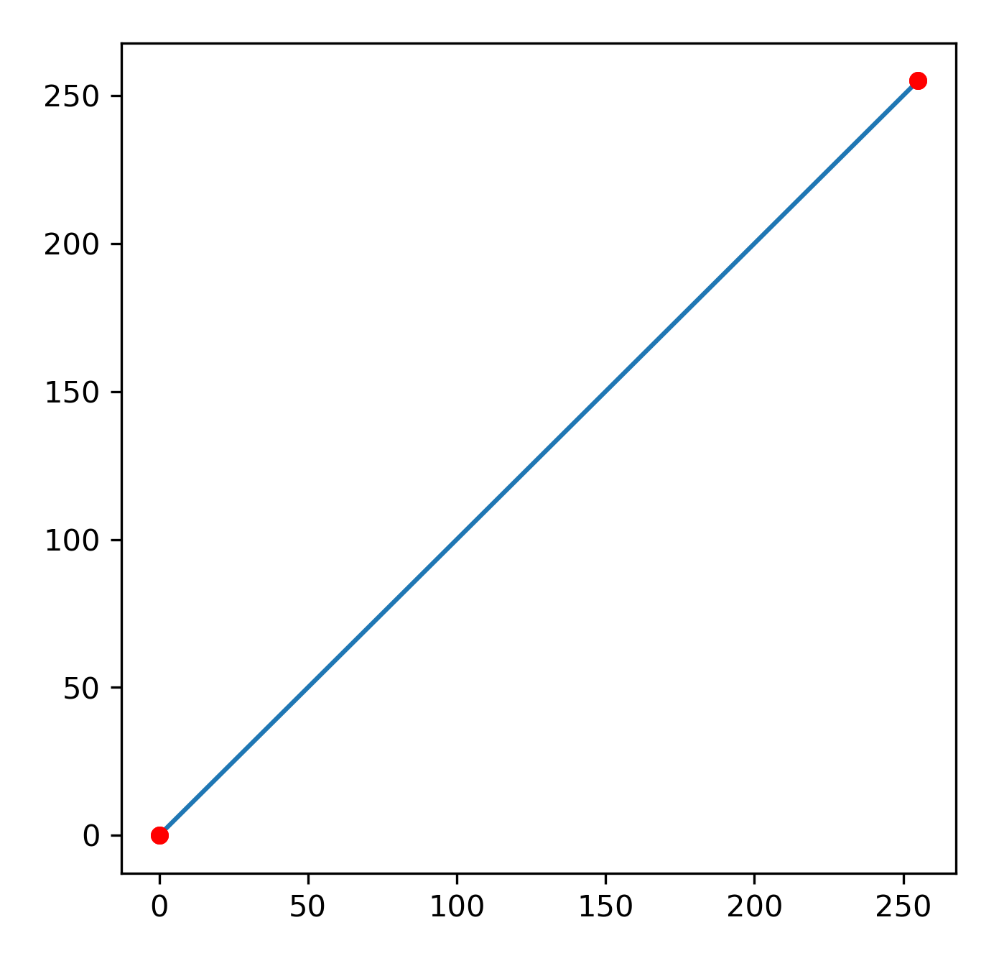

# DIP
 ## Digital Image Processing

> Algorithm: Piecewise Linear Stretch Transformation


### Before processing

-------

<p>  </p>


### After processing

---------

<p>  </p>


### Requirements

--------

- OpenCV(Python)

- Matplotlib
- Numpy

```bash
pip install --upgrade pip
pip install matplotlib -i https://pypi.tuna.tsinghua.edu.cn/simple
pip install numpy -i https://pypi.tuna.tsinghua.edu.cn/simple
pip install opencv-python -i https://pypi.tuna.tsinghua.edu.cn/simple
```


### Optional parameters

----------------

- X1
- X2
- Y1
- Y2
